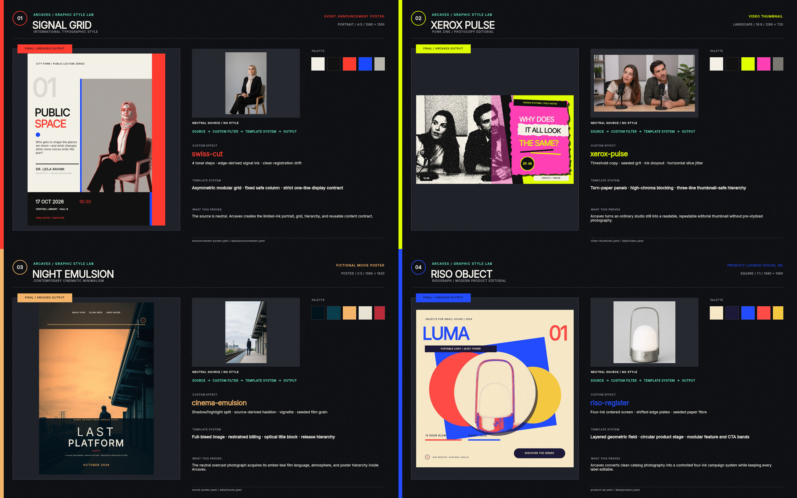

# Arcavex

Arcavex turns a YAML template plus a data file into a finished poster: a PNG, JPG, WebP, or PDF
that comes out byte-identical every time the same inputs are rendered. It is built for two readers
at once. A person who wants a poster, a social tile, a flyer, or an event graphic and does not want
to learn a design tool. And the AI assistant they ask to make it — Claude Code, Codex CLI, Claude
Desktop, or anything else with a shell or an [MCP](https://modelcontextprotocol.io) client. The
engine runs locally and headless, with no account and no network on the render path. It ships as a
CLI, an MCP server, and a design skill that teaches the assistant the craft: art direction first,
one design across several aspect ratios and languages, and looking at the picture rather than
trusting a clean validation.

Arcavex checks that a design is well-formed; it does not judge whether it is any good, and
[says so plainly](docs/known-limitations.md#validation-checks-geometry-not-design). Something still
has to look at the picture.

From a clone of this repository, the first render is one command:

```bash
arcavex render examples/hello-poster/template.yaml \
    --data examples/hello-poster/data.yaml --format square -o out.png
```

## Get it working

This section is written to be followed top to bottom, by you or by your assistant. Paste it to the
assistant with "set this up and make me a poster" and it has everything it needs.

**If the computer has neither Python nor uv** (a fresh Windows PC, typically), install
[uv](https://docs.astral.sh/uv/) first, then open a new terminal so it is on PATH. The install line
below asks uv for Python 3.12, the reference platform, and uv downloads a managed copy by itself if
the machine has none; nothing else needs installing.

- Windows: `winget install --id=astral-sh.uv -e`
- macOS or Linux: `curl -LsSf https://astral.sh/uv/install.sh | sh`

Then:

```bash
# 1. Install. This gives a global `arcavex` command; there is no virtual environment to activate.
uv tool install --python 3.12 git+https://github.com/payam-ranjbar/arcavex
arcavex doctor                     # every row should read ok

# 2. Teach the assistant the craft, then restart it (a host reads its skills at start-up).
arcavex skill install

# 3. Optional, for an MCP host (Claude Desktop, Claude Code, Codex): register the server,
#    then start a new session so the host connects to it.
arcavex mcp install

# 4. A first poster: scaffold a template and render it with its built-in sample data.
arcavex template new my-first-poster
arcavex render my-first-poster/template.yaml --format square -o first.png
```

The last command prints `inferred: data=preview_data` and then `Rendered first.png`. Open
`first.png` so the person can see it (`start first.png` on Windows, `open first.png` on macOS,
`xdg-open first.png` on Linux) and tell them its absolute path. To change the words, edit
`my-first-poster/data.yaml` and render again; `my-first-poster/README.md` explains the file.

Notes on the install:

- If uv warns that its tool directory `is not on your PATH`, run `uv tool update-shell` and open a
  new terminal. To update later, run the install command again with `--reinstall`.
- From a clone, `uv tool install <path-to-clone>` gives the same global command. A development
  install is `uv venv` then `uv pip install -e ".[dev]"`; the command is then
  `.venv/Scripts/arcavex.exe` (Windows) or `.venv/bin/arcavex` (elsewhere), or `uv run arcavex …`.
  Everything else — pip, ICU, fonts, the configuration home — is in [docs/install.md](docs/install.md).
- Once the package is published to PyPI, `uv tool install arcavex` will be the whole install. It is
  not published yet, and there are no GitHub releases yet; the repository URL is the install today.
- `arcavex skill install` writes the skill to `~/.claude/skills` (Claude Code) and
  `~/.agents/skills` (Codex and the ChatGPT desktop app). `--target` selects one (`claude-code`,
  `agents`; `codex` and `chatgpt` are aliases for `agents`), `--path DIR` covers anything else,
  `--project` installs into the current repository so it travels with a clone, and `--list` shows
  every destination without writing. The skill follows the [Agent Skills](https://agentskills.io)
  open standard, which fixes the `SKILL.md` format but not where a host looks for it.
- `arcavex mcp install` registers `arcavex mcp serve` as a stdio server with Claude Code, Claude
  Desktop, or Codex; `--print` shows the snippet for hand-editing any other host's configuration.
  Details in [docs/cli.md#mcp](docs/cli.md#mcp).

**New here?** [Install](docs/install.md) → [Quick start](docs/quick-start.md) (a 10-minute path
from a first render to exports, locales, and provenance) → [Tutorials](docs/tutorials/).

## Working with an assistant

An assistant reaches the engine in one of two ways.

- **Through a shell**, as the CLI: Claude Code, Codex CLI, Cursor, or anything with code execution.
  This is the only route with the whole surface, including extension authoring and the
  project/provenance commands.
- **Through an MCP host** (Claude Desktop, or Claude Code and Codex once registered): the same
  operations as tools over stdio, plus the design skill served as resources under
  `skill://arcavex-design-studio/`, so the assistant learns the template grammar and the authoring
  loop from the engine it is connected to rather than reconstructing them from validation errors.

The loop is the same on both routes: inspect the template's contract, edit it (a path-addressed
patch or a data change), validate, preview and look at the picture, inspect the resolved layout for
overlaps, then render the final files. The skill gives the assistant the role of a senior designer
around that loop: establish the art direction before composing, treat every aspect ratio as its own
problem, check for overlaps and tight margins rather than trusting a clean validation — and, when
the built-in vocabulary cannot express a style, **author the missing effect** instead of dropping
it:

```bash
arcavex ext scaffold effect ./my-effect --name grain-warp   # a working effect, not a stub
arcavex ext validate ./my-effect && arcavex ext test ./my-effect
arcavex ext add ./my-effect && arcavex ext enable grain-warp
```

That loop needs a shell; the MCP server does not expose extension authoring.

**Show the person the result.** A render is a file on disk, and the person will not go looking
for it. Open it for them — `start out.png` on Windows (`Invoke-Item out.png` in PowerShell),
`open out.png` on macOS, `xdg-open out.png` on Linux — and state its absolute path. Over MCP,
`arcavex_render_preview` returns the PNG as image content, so the host shows it inline.

Every CLI call pays about a second of process start-up. When iterating on a design, `arcavex
preview TEMPLATE --watch` keeps the engine loaded and re-renders on every save, and an MCP
session keeps it loaded between tool calls.

## Arcavex Desktop

Arcavex Desktop is not yet distributed: there is no installer to download, and no release has been
cut. It is built from source in [`apps/desktop`](apps/desktop/) (Tauri and React, targeting
Windows); the release lane that will publish a signed installer exists but has not shipped one.
What follows describes the application as built.

It is the same engine with a window on it: it runs a pinned, frozen copy of the engine as a sidecar
and talks to it over MCP, so what the window renders is what `arcavex render` renders. It shows the
layer tree the engine reports, the measurements the engine computed, and the proof it produced — no
second layout implementation.

It also **edits**, and it edits the project's source files rather than a document model of its own.
A gesture becomes one semantic transaction; the engine rewrites `template.yaml` preserving
comments and key order, or refuses and writes nothing at all. Because those files are shared with
the CLI and with an assistant working over MCP, edits carry the revision they were composed
against, undo history belongs to the project rather than to the window, and a collision is
reported as a conflict naming the files that moved. [Desktop editing](docs/desktop/editor.md)
covers the model, the refusals, and what cannot be edited in place.

## Documentation

Everything below is reachable within two clicks from this index.

| Doc | What it covers |
|---|---|
| [Install](docs/install.md) | Global command, from-source and wheel installs, ICU/fonts, `doctor`. |
| [Quick start](docs/quick-start.md) | Render → change data → new format → locale → export → provenance. |
| [Tutorials](docs/tutorials/) | Build a template from scratch · a bilingual template · using/writing extensions. |
| [Connecting an assistant](docs/cli.md#skill) | `skill install` and, one section down, [`mcp`](docs/cli.md#mcp): serving and registering the MCP server. |
| [Template authoring reference](docs/template-schema.md) | Every section, node kind, constraint, size, expression, locale, patch, and effect. |
| [CLI reference](docs/cli.md) | Every command, its flags, and a verified example. |
| [Diagnostics](docs/diagnostics.md) | The coded-diagnostic catalog, exit codes, and `explain`. |
| [Architecture](docs/architecture.md) | The microkernel map, pipeline, SPI contracts, determinism, provenance. |
| [Extension guide](docs/extension-guide.md) | Trusted local extensions: the SDK, manifest, gates, trust model. |
| [Known limitations](docs/known-limitations.md) | Honest list of what is deferred, where perf misses, and [why validation checks geometry rather than design](docs/known-limitations.md#validation-checks-geometry-not-design). |
| [Performance](docs/performance.md) | Measured actuals vs the spec §8.2 targets. |
| [Testing](docs/testing.md) | The test layers and the per-platform golden strategy. |
| [Packaged install](docs/packaged-install.md) | The clean-venv wheel transcript (byte-identical proof). |
| [Desktop editing](docs/desktop/editor.md) | How Arcavex Desktop edits source files: transactions, refusals, conflicts, shared undo. |
| [Contributing](docs/contributing.md) | Dev setup, make targets, golden/ADR process. |
| [ADRs](docs/adr/README.md) · [Backlog](docs/backlog.md) · [Changelog](CHANGELOG.md) | Decisions, deferred work, release notes. |

## Examples

The shipped examples live under [`examples/`](examples/): `hello-poster` (the two-format,
asset-free template the quick start renders first), `future-archive-poster` (a multi-format
bilingual system with a custom raster extension), `graphic-style-lab` (four art directions across
announcement, product ad, movie poster and video thumbnail), and `extensions/` (a minimal
extension with its golden fixture). A `uv tool install` from the repository URL does not include
them; clone the repository, or start from `arcavex template new`.

The Future Archive poster uses an effect that ships *with the example*, not with the engine, so
add and enable that extension once before rendering it — without those two commands the render
refuses with `ARC-FX-910 unknown effect 'archive-print'`:

```bash
arcavex ext add examples/future-archive-poster/extensions/archive-print
arcavex ext enable archive-print
arcavex render examples/future-archive-poster/template.yaml --format square -o out.png
```

## Showcase — Future Archive, authored through MCP

[`examples/future-archive-poster/`](examples/future-archive-poster/) is a production-style proof
that an AI client can author and verify an Arcavex template through MCP. It combines original
generated source art, a reusable style pack, a custom deterministic `archive-print` effect, and
separate composition rules for each ratio and writing direction.

| English — LTR | Farsi — RTL |
|---|---|
|  |  |

One template renders square (`1080×1080`), portrait (`1080×1350`), story (`1080×1920`), and
landscape (`1920×1080`) output in English or Farsi. The locale layer changes direction, alignment,
font fallback, and digits; format patches recompose the design rather than stretching it. The
[English](examples/future-archive-poster/data/en.yaml),
[Farsi](examples/future-archive-poster/data/fa.yaml), and
[boundary-test](examples/future-archive-poster/data/) data are included with the example.

Arcavex is style-agnostic. Its typography, layout, shapes, masks, images, effects, style packs, and
extension API can encode essentially any 2D visual language taught or practiced in graphic design—from
International Typographic Style and Bauhaus to editorial, constructivist, brutalist, pop, and
experimental systems. The style still has to be deliberately defined in a template; Arcavex makes
that system reusable and deterministic.

### How the MCP workflow works

An MCP client starts `arcavex mcp serve` over stdio and discovers the same operations exposed by
the CLI. An agent can then inspect the template contract and available effects, apply
path-addressed edits, validate the result, receive a rendered preview as an image, inspect resolved
layout, and produce final outputs. MCP does not use a separate renderer: every call goes through
the same Arcavex service layer as the CLI and Python API.

This example was tested through the real MCP server:

| Coverage | Result |
|---|---:|
| Normal + boundary content | 16/16 passed |
| Ratios | 4 |
| Locales | English + Farsi |
| Effects discovered | 16, including `archive-print` |
| Validation, preview, layout inspection, render | All passed |
| Warnings and diagnostics | 0 |
| Repeat render | Byte-identical |

See the [template and authoring notes](examples/future-archive-poster/),
[custom effect](examples/future-archive-poster/extensions/archive-print/), and
[MCP test report](examples/future-archive-poster/output/mcp-report.json).

## Showcase — four styles, four real contexts

The [`Graphic Style Lab`](examples/graphic-style-lab/) starts with four neutral source images and
uses Arcavex to create four unrelated visual systems: a Swiss event announcement, xerox-punk video
thumbnail, cinematic movie poster, and risograph product ad.



| Visual system | Context | Format | Custom effect |
|---|---|---|---|
| Signal Grid | Event announcement | 4:5 | `swiss-cut` |
| Xerox Pulse | Video thumbnail | 16:9 | `xerox-pulse` |
| Night Emulsion | Movie poster | 2:3 | `cinema-emulsion` |
| Riso Object | Product-launch ad | 1:1 | `riso-register` |

The generated inputs contain no typography or final style treatment. Arcavex applies the image
filter, palette, composition, type hierarchy, effects, and content constraints. Each example ships
with editable data and a source-versus-output reference sheet. The real MCP server inspected,
validated, previewed, checked layout, and rendered all eight deliverable/reference cases; 8/8
passed with no warnings or diagnostics, and the repeat render was byte-identical. See the
[`style-lab-filters`](examples/graphic-style-lab/extensions/style-lab-filters/) extension and
[`MCP report`](examples/graphic-style-lab/output/mcp-report.json).

## Output files

The output extension selects the format — `.png`, `.jpg`/`.jpeg`, `.webp`, or `.pdf`. `--quality`
sets the lossy encoder quality (JPEG, lossy WebP) and `--lossless` selects lossless WebP. PDF is
raster-embedded RGB at the target DPI with the correct physical page size and trim/bleed boxes, so
`A4 + bleed` prints correctly. Every format is deterministic: identical inputs produce
byte-identical files, with no embedded timestamps or run ids.

Rendering without `-o` writes a deterministic default file,
`<template-stem>.<format>[.<locale>].png`, in the current directory and reports the chosen name
before rendering (on failure too, so you always learn what would have been written). The
`.<locale>` segment is present only when `--locale` is applied, so a `fa` render never
overwrites the `en` one. When a template declares exactly one format, or when no `--data` is
passed and `preview_data` exists, Arcavex infers the value and reports it (human output and the
`inferred` object in `--json`).

## Commands

Full flags and verified examples are in the [CLI reference](docs/cli.md); this is the overview.

| Command | Purpose |
|---|---|
| `render TEMPLATE [--data D] [--format F] [--locale L] [--style S] [-o OUT] [--quality Q] [--lossless]` | Render to an image or PDF; the `-o` extension (`.png`/`.jpg`/`.webp`/`.pdf`) picks the format. |
| `validate [TEMPLATE] [--data D] [--format F] [--locale L] [--style S] [--project P]` | Validate without rendering. Omit `TEMPLATE` to validate the current project (project mode). |
| `preview [TEMPLATE] [--data D] [--format F] [--locale L] [--style S] [--project P] [--watch]` | Render to a stable preview path; `--watch` re-renders on every save. Omit `TEMPLATE` to preview the current project. |
| `template new DIR` | Scaffold a minimal renderable template (template.yaml + data.yaml + README). |
| `template check PATH [--format F] [--locale L] [--style S]` | Validate a template without data (schema + structure + preview_data). |
| `template inspect PATH [--json]` | Report the authored contract: variables, formats, locales, nodes, functions, example data. |
| `template patch PATH [--set P --value V \| --remove P \| --insert-before P --node J \| --insert-after P --node J \| --ops-file F] [--base-sha256 H]` | Apply path-addressed set/remove/insert ops to a template on disk (comment-preserving); the AI mutation contract, also on the CLI. |
| `template split PATH` | Convert a one-file template into a split directory, losslessly. |
| `data set KEYPATH VALUE [--project P]` | Set a single value in the current project's data (VALUE parsed as JSON, else a string), then revalidate. |
| `data import [FILE] [--locale L] [--project P]` | Merge a YAML data document (or stdin) into the project's data under overlay semantics. |
| `asset add SOURCE [--project P]` | Ingest an image into the content-addressed store and report its reference. |
| `asset annotate SHA256 [--set k=v ... \| --annotations J]` | Write sidecar annotations (facing/focal_point/tags) onto an ingested asset. |
| `style list [--json]` | List installed style packs (palettes, presets, roles). |
| `style inspect NAME [--json]` | Show a style pack's palettes, fonts, effect presets, and role defaults. |
| `effects list [--json]` | List registered effects with their category and each param's type, default, and range. |
| `effects inspect NAME [--json]` | Show one effect's category and full parameter schema. |
| `font list [--json]` | List every resolvable font family, marking bundled vs installed, and name the install directory. |
| `font add PATH [--license PATH]` | Install a `.ttf` into `$ARCAVEX_HOME/fonts` and report the family name templates must use. |
| `font remove FAMILY [--json]` | Remove an installed font family; a family bundled with the engine is refused. |
| `skill install [--target T …] [--path DIR] [--project] [--force] [--list]` | Install the bundled design skill into each assistant's skill directory; restart the assistant afterwards. |
| `doctor [--json]` | Check the environment (Python, Skia, ICU, fonts, exporters, cache, temp dir, paths, config) and engine version. |
| `explain ARC-XXX-NNN [--json]` | Explain a diagnostic code and its typical fix. |

### Projects, library, and provenance (§5)

| Command | Purpose |
|---|---|
| `template publish DIR --name N --version V [--no-default]` | Publish a template into the library as an immutable `N@V`; sets the default alias unless `--no-default`. |
| `template detach [--project P]` | Copy the project's library template into the project (disables version upgrades). |
| `project new DIR --template REF [--name N] [--style S] [--format F ...] [--locale L ...]` | Scaffold a renderable project pinning a template (`name@version` or a path). |
| `project clone DIR [--name N] [--project P]` | Clone a project into a new directory, reset to draft, dropping recorded runs. |
| `project set-status STATUS [--project P]` | Set the project status (`draft`/`review`/`approved`/`published`). |
| `project upgrade --to V [--yes] [--project P]` | Preview a template-version upgrade (structural stale paths + perceptual diff); `--yes` updates the pin. |
| `status [--project P]` | Show the current project's manifest and recorded-run count. |
| `render [--project P] [--format F] [--locale L] [--dpi N]` | With no template, render the discovered project's formats × locales into a recorded run. |
| `render TEMPLATE --record [...]` | Direct render that also writes a run manifest. |
| `list-runs [--project P] [--path DIR]` | List recorded runs newest first — the project's, or with `--path` the runs under a direct-mode `outputs/` directory. |
| `rerun outputs/<run>` | Reproduce a recorded run into a new run directory (byte-identical on the same engine + platform). |
| `diff outputs/<run-a> outputs/<run-b>` | Per-output pixel/perceptual diff plus template/data/asset/font/engine/option changes. |
| `batch <projects-glob> [--jobs N]` | Render every matched project in parallel jobs; output is byte-identical to serial. |

The CLI discovers `project.yaml` by walking upward from the current directory; `--project PATH`
overrides discovery. There is no persistent open-project state. A project references a library
template by `name@version` (bare `name` needs an explicit default alias) or by a filesystem
path. Recorded runs live under `outputs/<timestamp>_<shorthash>/` with a `manifest.json` pinning
every input by hash; the exported PNG bytes contain no timestamp or run id, so a same-platform
rerun reproduces them exactly. The full provenance model is in
[architecture.md](docs/architecture.md#run-and-provenance-model).

Every command supports `--json`, `--no-color`, and `--quiet`. `--locale L` applies a declared
locale (direction, digit policy, font overrides, data overlay, and patch); requesting a locale
the template does not declare is a located error (`ARC-TPL-100`). `arcavex layout inspect
TEMPLATE [--data D] [--format F] [--locale L] [--json]` reports resolved geometry, and
`render`/`preview --debug` overlays node bounds, ids, baselines, and the safe-area margin.

Direct-mode `render TEMPLATE --record` runs (recorded outside a project) are `rerun`- and
`diff`-able by path, and `list-runs --path <outputs-dir>` lists them; `list-runs` with no project
and no `--path` falls back to a `./outputs` directory beside the current directory.

#### Project overrides (the PROJECT resolution layer)

A project can override its pinned template without forking it, using an override patch file:

- **Location & name:** `overrides/<template-name>.patch.yaml`, where `<template-name>` is the
  template's name before `@` (e.g. a project pinned to `ipen-poster@1.0.0` uses
  `overrides/ipen-poster.patch.yaml`). `project new` scaffolds an empty `overrides/` directory.
- **Contents:** a YAML **list** of patch operations — the same vocabulary as format/locale
  patches: `set`, `remove`, `insert_before`, `insert_after`, each addressing a node by
  `nodes.<id>[.<field>...]`. Example:
  ```yaml
  - set: nodes.background.style.fill
    value: '#00ff00'
  - remove: nodes.watermark
  ```
- **Resolution order:** the override is the **PROJECT layer**, applied last, after the style →
  template → format → locale layers (spec §5.4) — so it is the project's final structural word.
- **Provenance:** the applied override is captured in the run manifest by canonical content hash
  (`patch`), so `diff` attributes a patch-only change (`overrides` / `overrides.hash`) and
  `rerun` names it if the file changed on disk since the run was recorded (`ARC-RUN-002`).
  `project upgrade` reports override paths that no longer resolve against the target version.

#### Runtime configuration precedence (§6.3)

Settings resolve highest-first through **CLI flag → `ARCAVEX_*` env var → `project.yaml` →
`~/.arcavex/config.toml` (or `$ARCAVEX_HOME/config.toml`) → built-in default**. The wired setting
is the default render DPI:

- `--dpi N` on `render`/`batch`/`preview` (highest),
- `ARCAVEX_DPI=N` in the environment,
- `dpi: N` in `project.yaml` (project mode),
- `[render] dpi = N` in `config.toml`,
- otherwise each format renders at its own declared canvas DPI (the default).

`arcavex doctor` reports whether a `config.toml` is present and which layer the default DPI
resolves from.

`config.toml` also carries the resource-budget and cache tables that the budget diagnostics
(`ARC-RND-020..023`) and `doctor` point at — edit these to raise a limit a large render trips or
to resize the derived-image cache:

| Table / key | Default | What it bounds |
|---|---|---|
| `[budgets] max_dimension` | 30000 | Largest output width or height, in pixels (`ARC-RND-020`). |
| `[budgets] max_pixels` | 400000000 | Largest total output pixel count (`ARC-RND-021`). |
| `[budgets] max_surface_bytes` | 2000000000 | Peak render-surface memory, in bytes (`ARC-RND-022`). |
| `[budgets] max_wall_ms` | 120000 | Per-render wall-clock ceiling, in milliseconds (`ARC-RND-023`). |
| `[cache] derived_bytes` | 256000000 | Byte budget for the derived-image cache; both its memory and disk tiers are held under it, LRU-evicting the oldest variants (§4.7). |

## MCP authoring surface (§6.2)

Arcavex ships an [MCP](https://modelcontextprotocol.io) server with every install, so an AI agent
can author templates and projects through the same service API the CLI uses — never a second
engine. Every tool is a thin wrapper over one facade method and returns the **same** versioned
pydantic result the CLI's `--json` returns, with structured, coded, located diagnostics (never
scraped text). The transport is stdio only (no network).

| Command | Purpose |
|---|---|
| `mcp serve` | Start the stdio MCP authoring server (blocks until the client disconnects). |
| `mcp tools [--json]` | Print the tool catalog (names, descriptions, and input/output JSON schemas) for discovery. |
| `mcp install [--print]` | Register the server with Claude Code, Claude Desktop, or Codex; `--print` shows the configuration snippet for any other host. |

Register it with `arcavex mcp install`, or wire it into any MCP client by hand as a stdio server
running `arcavex mcp serve` ([docs/cli.md#mcp](docs/cli.md#mcp)). The catalog mirrors the CLI in
families; `arcavex mcp tools` lists the live set:

- **Templates** — list, inspect, validate, patch, scaffold (`_new`), publish, detach.
- **Projects** — create, list, status, clone, render, and the recorded-run tools (`_run_list`,
  `_run_diff`, `_run_rerun`).
- **Content** — data set/import, asset add/annotate.
- **Vocabulary** — styles, effects, and fonts, listed and inspected.
- **Seeing** — `arcavex_render_preview` (returns the PNG as image content; `debug=true` overlays
  the layout), `arcavex_layout_inspect` (resolved geometry and classified overlaps),
  `arcavex_render`, `arcavex_render_record`, and `arcavex_diagnostic_explain`.
- **Editing** — the semantic transactions Arcavex Desktop submits (`arcavex_editor_apply`, undo,
  redo, history) and the snapshot, layer-tree, hit-test, policy, and proposal tools the desktop
  reads its window from.

Every tool delegates to a facade method that is also reachable from the CLI/Python API, so MCP adds
no exclusive capability (a linted boundary, spec §12.18). The parity model is in
[architecture.md](docs/architecture.md#mcp-parity).

The server also **serves its own manual**: the bundled design skill and its references are MCP
resources under `skill://arcavex-design-studio/`, so an assistant can learn the template grammar
and the authoring loop from the engine it is connected to rather than reconstructing them from
validation errors.

The intended authoring loop (also the server's advertised `instructions`):

1. `arcavex_template_inspect` — read the contract: variables, formats, **locales**, node ids,
   functions, and example data, so the agent never infers the contract from raw source.
2. `arcavex_template_patch` — edit an addressed node (`nodes.<id>[.<field>]`). A leaf field in a
   fixed-vocabulary block (style/fit/paragraph/constraints) is validated before writing, so a
   typo (`fontsize` for `font_size`) is a located `ARC-TPL-051`, not a silent write; an op that
   does not name exactly one verb is a located `ARC-TPL-092`.
3. `arcavex_template_validate` → `arcavex_render_preview` (see the image) →
   `arcavex_layout_inspect` (resolved geometry, overlaps a compile-clean validate misses). Each
   overlap is classified `content` (the layout boxes genuinely collide — act on it) or `halo`
   (only the effect-grown paint boxes touch, e.g. a drop-shadow reaching over a neighbour), so an
   agent that cannot see the render filters on `kind` instead of confirming each one by eye.
4. To author real content: `arcavex_project_create` → `arcavex_data_set` / `arcavex_data_import`
   (a keypath matching no declared variable warns with `ARC-TPL-112`) → `arcavex_project_render`
   for a recorded run that `arcavex_run_list`/`_diff`/`_rerun` then operate on.

## Template authoring

A one-file template is a YAML mapping with `version`, `variables`, `formats`, `locales`,
`preview_data`, `style`, and a `root` node tree; a larger template may be split into a directory
(`template.yaml` + `schema.yaml`/`formats.yaml`/`locales.yaml`/`preview-data.yaml` sidecars) without
changing semantics. Nodes (`group`, `text`, `image`, `shape`, `path`) are positioned with
constraint **anchors** (physical `top`/`left`/… and logical `start`/`end` edges that mirror under
RTL), explicit **sizes** (fixed/percent/`fill`/`fit_content`/`aspect`), and **stacks**
(`layout: hstack|vstack`). `repeat`/`if` expand into siblings; `{{ }}` expressions bind variables and
call registered functions; text nodes carry **fit policies** (`wrap`/`shrink_to_fit`/`truncate`);
locales apply direction, digit policy, fonts, a data overlay, and patches; and any node may carry an
ordered **effects** list (`arcavex effects list` names the built-ins).

The complete authoring reference — every section, node kind, constraint, size form, expression
function, locale/data-layering rule, patch grammar, and effect — is
**[docs/template-schema.md](docs/template-schema.md)**. What is deliberately deferred (`fit_content`
scope, wrapping stacks, `line_height`, vector PDF/CMYK, cross-platform bit-exactness) is in
**[docs/known-limitations.md](docs/known-limitations.md)**. Every `ARC-…` diagnostic is catalogued in
**[docs/diagnostics.md](docs/diagnostics.md)** and explained on the spot by `arcavex explain CODE`.

See the `examples/future-archive-poster/` bilingual system for locales, stacks, masks, sibling anchors,
rotation, and fit policies in one template, and `arcavex-technical-design-spec-v1.1.md` for the full
specification.
