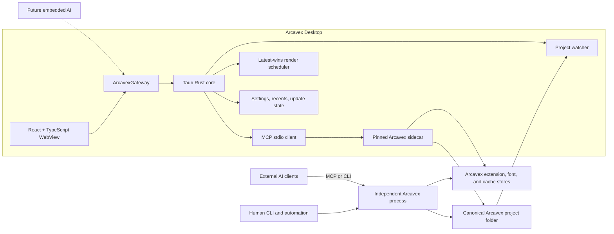

# Arcavex Desktop Architecture Design

**Status:** Approved in design review
**Date:** 2026-08-08
**Initial release target:** Windows x64
**Long-term targets:** Windows, macOS, and Linux

## 1. Summary

Arcavex Desktop will be the definitive graphical interface for Arcavex while preserving Arcavex as
an independent, local-first rendering engine. The desktop is a thin client over public,
versioned engine contracts. It does not import Python services, Skia, compiler internals, or the
extension registry.

The selected stack is Tauri 2 with a React, TypeScript, and Vite frontend. The Tauri Rust core owns
operating-system access, runs a pinned Arcavex binary as a long-lived MCP stdio sidecar, watches
projects, schedules renders, and sends typed events to the frontend. The React frontend owns only
presentation and ephemeral interaction state.

The same Arcavex engine remains independently usable through its CLI and MCP server. External AI
clients may modify the same canonical project while the desktop is open; the desktop detects those
changes and updates the preview and activity stream. A future embedded AI harness will call the
same application gateway instead of receiving private access to engine internals.

The complete product vision spans several independently specified phases. The first implementation
plan will cover the shared foundation and Phase 1 viewer only. Editing, full layer mutation,
asset-authoring workflows, and embedded AI require later design specifications and implementation
plans.

## 2. Goals

1. Ship one desktop project that can target all supported operating systems, beginning with
   Windows x64.
2. Bundle an exact, tested Arcavex engine build without making the engine dependent on the UI.
3. Open existing Arcavex projects in place. The project folder remains the only project truth.
4. Show external AI, CLI, and filesystem changes in near real time.
5. Render the active format and locale after every committed change by default.
6. Present authored and rendered elements as a Photoshop-like hierarchical Layers panel.
7. Establish semantic engine operations for later text, transform, layer, effect, and asset
   editing; the frontend must never rewrite YAML directly.
8. Discover effects, extensions, fonts, schemas, and future capabilities dynamically.
9. Make branding and runtime UI themes replaceable through validated contracts.
10. Automate tests, coordinated versioning, signed update artifacts, and GitHub releases through
    GitHub Actions.
11. Preserve Arcavex's deterministic rendering, diagnostics, provenance, extension boundaries, and
    microkernel dependency rules.

## 3. Phase 1 non-goals

Phase 1 does not provide direct manipulation, text editing, layer reordering, undo/redo, asset
preprocessing, extension authoring, arbitrary UI plugins, embedded AI APIs, cloud collaboration, or
multi-user synchronization. It does not attempt pixel-perfect alpha-aware hit testing. A later
phase must not expose translation or scale handles until the corresponding engine behavior is
implemented and verified.

The first release has one stable update channel and one Windows x64 installer. macOS, Linux,
prerelease channels, app-store packaging, and mobile targets are deferred without changing the
runtime boundaries defined here.

## 4. Existing engine baseline and identified gaps

Arcavex is already a microkernel. `kernel.api.Facade` is the public application boundary, and the
CLI and MCP server are thin clients over it. Pydantic result models are versioned. Existing preview
operations use a stable output path, atomically replace a successful render, and preserve the last
good image when a later render fails. Existing patch operations use stable node IDs and can reject
a stale `base_sha256`.

The engine already supplies much of the read-only information needed by a desktop:

- project listing, status, rendering, runs, and provenance;
- template formats, locales, variables, node IDs, effects, fonts, and extensions;
- preview render timing, diagnostics, hashes, and stable output paths;
- a nested resolved layout report with bounds, paint bounds, affine transforms, rotations,
  overflow, anchor derivations, overlaps, and stable IDs;
- a hierarchical scene graph made from groups, text, images, shapes, and paths;
- per-node visibility and sibling `z` ordering, with document order as the stable tie-breaker.

The following gaps affect the desktop design and must be addressed at the engine boundary rather
than worked around in React:

1. Template inspection reports authored nodes as a flat list; it does not report parentage,
   sibling order, `z`, visibility, display metadata, or a source revision suitable for a Layers
   panel.
2. Layout inspection is nested but is primarily a geometry report. It does not expose all authored
   metadata and should not be treated as the editable source document.
3. Patch operations support set, remove, insert-before, and insert-after, but not atomic move,
   reparent, duplicate, group, or stable-ID rename operations.
4. Project-scoped structural patch authoring is not yet a complete public Facade/MCP capability.
5. The compiler accepts `transform.translate`, but the current layout/backend path does not apply
   it. Scale is explicitly unsupported. Phase 2 must correct these engine contracts before exposing
   transform controls.
6. There is no authoritative hit-test API that understands paint order, clipping, masks, and
   rendered instances.
7. Locks and human-readable layer names are not current template concepts.
8. Some project preview, validation, status, and mutation capabilities exposed by the Facade/CLI
   need MCP parity before the desktop can use MCP as its only engine transport.

## 5. Stack decision

### Selected: Tauri 2 + React/TypeScript/Vite + Arcavex sidecar

Tauri explicitly supports bundling external Python/PyInstaller binaries as sidecars and has a
multi-process model appropriate for isolating an expensive or crash-prone renderer from the UI.
React and TypeScript provide the component ecosystem and web-style extension path needed for a
future full design application. Rust provides a narrow, typed operating-system and process
boundary.

The Tauri core will use an MCP client over child-process stdio. The browser WebView cannot start
processes or access raw MCP. Only a single frontend adapter may call Tauri commands; feature code
uses `ArcavexGateway`.

### Rejected alternatives

- **Electron + React:** technically viable and a fallback if native WebView incompatibilities
  become material, but it carries a larger bundled runtime and higher memory cost.
- **PySide6/QML:** offers direct Python integration, but that convenience encourages the desktop to
  couple to engine internals and does not dogfood the public MCP boundary.

## 6. Runtime architecture



There is no localhost HTTP service or required daemon in Phase 1. The desktop owns a private,
long-lived stdio process and restarts it when necessary. External clients may run their own
Arcavex process against the same project. The filesystem and revision contracts synchronize those
processes; memory is never shared.

The pinned sidecar is an exact engine release artifact, not an editable copy of the engine source.
The desktop release records the engine version, source tag, artifact SHA-256, MCP contract version,
IR version, and supported capability set. Startup fails into a diagnostic mode if this handshake is
incompatible.

By default the sidecar resolves the same Arcavex home as the standalone CLI and MCP server so
installed fonts, extensions, styles, and caches are visible consistently. An explicit Arcavex-home
override is shown in diagnostics and settings. Development and test builds may use an explicit
engine-executable override; stable packaged builds always start the locked bundled artifact.

## 7. Repository and module boundaries

One cross-platform application will live under `apps/desktop/` in the existing repository.
Platform-specific packaging belongs below the Tauri boundary rather than in separate UI projects.

```text
apps/desktop/
  package.json
  package-lock.json         deterministic npm dependency graph; CI installs with npm ci
  src/
    app/                    application composition and routes
    contracts/              generated engine types and hand-written UI ports
    gateway/                the only frontend-to-Tauri adapter
    features/
      projects/
      workspace/
      canvas/
      layers/
      variants/
      activity/
      diagnostics/
      capabilities/
      settings/
      updates/
    theme/                  semantic tokens, manifests, validation, built-ins
    shared/                 UI primitives with no feature knowledge
  src-tauri/
    src/
      gateway/              typed commands exposed to the WebView
      engine/               MCP transport and sidecar supervisor
      projects/             watcher, revision tracking, recent-project bridge
      rendering/            queue, cancellation, result publication
      events/               typed desktop event envelope
      settings/             app-local preferences and policy bridge
      updates/              version and updater integration
    binaries/               CI-staged pinned sidecar artifact
    capabilities/           least-privilege Tauri permissions
```

The module rule is dependency inversion: feature modules depend on ports and generated contracts,
not Tauri, MCP, filesystem paths, or engine internals. `ArcavexGateway` is mockable so the frontend
can be tested and previewed without a running engine.

Asynchronous engine state is cached and invalidated through a query layer. Ephemeral UI state such
as selection, zoom, panel layout, and open disclosures is held separately. Neither store becomes a
second authoritative document model. Later editing features issue commands and consume returned
snapshots rather than mutating a frontend-owned scene tree.

Internal features register commands, panels, inspectors, and settings through contribution
registries. Phase 1 does not expose a third-party React plugin API. This keeps the shell extensible
without committing to an unsafe or unstable UI-extension ABI.

## 8. Public desktop-facing engine contracts

The engine Facade remains the source of all business behavior. Every desktop-required operation
must also be exposed through MCP with the same versioned result model.

### 8.1 Engine handshake

The startup report includes:

- engine semantic version and build commit;
- binary artifact SHA-256;
- MCP contract/response version;
- IR versions accepted and produced;
- extension SDK version;
- a named capability set rather than UI-side version guesses;
- Arcavex home and relevant store locations;
- diagnostics from the equivalent of `doctor`.

The UI gates features on capabilities. An additive engine feature can therefore appear without a
desktop rewrite, while an incompatible contract produces a clear diagnostic instead of a transport
failure.

### 8.2 Project snapshot and revision

A project snapshot includes the canonical absolute project path, project metadata, source files,
formats, locales, selected/default targets, project status, project revision SHA-256, render
revision SHA-256, layer-definition tree, current rendered-instance tree when requested, capability
vocabulary, and diagnostics.

The **project revision** covers all engine-managed project source and metadata that can participate
in a semantic transaction, including `project.ui.yaml` and project automation policy. It is the
optimistic-concurrency guard for mutations. The **render revision** covers only render-affecting
source, assets, and pinned dependency references. It keys preview jobs, so renaming or locking a
layer does not trigger an unnecessary render. App-global preferences and cached previews affect
neither revision. Engine working queues such as `.arcavex/pending/` also affect neither revision;
each queued proposal instead records the project revision it was based on. Exact hash manifests are
returned for diagnostics so a conflict can name which file changed.

### 8.3 Layer tree

`LayerTreeReport` is an engine contract, not a tree reconstructed by the UI. Each authored entry
contains:

- stable authored node ID and optional rendered instance ID;
- parent ID, authored child index, resolved paint index, and `z`;
- node kind and origin (`static`, `if`, or `repeat`) with construct metadata;
- user-facing display name from editor metadata, falling back to the stable ID;
- visibility, lock state, effects, mask, and whether the entry is editable;
- resolved bounds, paint bounds, affine transform, rotation, overflow, and source location when a
  target is compiled;
- children in authored or rendered order as requested.

The Layers panel displays the highest painted sibling at the top, while preserving nested groups.
It offers two modes:

- **Definition:** the reusable authored tree; a conditional or repeated definition appears once.
- **Rendered:** actual instances for the active data, format, and locale; generated instance IDs map
  back to their authored source ID.

Effects and masks appear as expandable subrows but are not independent layers unless the engine
later makes them independent scene nodes.

Non-rendering editor metadata travels with the project in a versioned `project.ui.yaml` sidecar.
It stores display names, lock state, optional layer colors, and project-local workspace preferences,
keyed by stable node ID. It is managed through engine contracts, ignored by render hashes, and may
be safely absent. App-global panel layout, themes, and recent projects remain in the platform app
data directory.

### 8.4 Selection and hit testing

Phase 1 supports layer selection from the tree and geometry-based canvas hit testing. Hit testing
returns ordered candidates from topmost to bottommost with authored and instance IDs. The engine,
not React, determines hierarchy and paint order. Pixel-alpha-, path-, mask-, and clip-aware hit
testing may refine the result later without changing the UI command.

### 8.5 Future semantic mutation API

Phase 2 commands will cover text/property changes, visibility, move, resize, rotate, reorder,
reparent, duplicate, delete, group, display-name changes, and effect-list changes. A request carries
project path, active target, base revision, actor, command ID, and typed command payload. A response
contains the new project and render revisions, changed files and layer IDs, diagnostics, and an
inverse transaction when undoable.

Stable IDs are not casual display names. A future stable-ID rename command must transactionally
rewrite sibling anchors, patches, editor metadata, and other supported references. Reparenting must
detect cycles and invalid sibling-anchor dependencies before committing. The UI never approximates
these operations with remove-and-insert YAML edits.

## 9. Project ownership and synchronization

Opening a project never imports or copies it. Arcavex Desktop stores only a recent-project pointer
and app preferences outside the project. Source, project UI metadata, and engine-managed working
history remain in the project folder.

Every semantic mutation follows this sequence:

1. The caller submits a command with a base project revision and optional actor metadata.
2. The engine obtains a short-lived cross-process project mutation lock.
3. It loads the current snapshot and checks the revision.
4. A safe non-overlapping change may rebase automatically; an overlapping change is rejected.
5. The engine applies the operation in memory, performs structural validation, and writes through
   temporary files plus atomic replacement.
6. The watcher coalesces the resulting filesystem events and computes the new revision.
7. The desktop deduplicates an event already acknowledged by its own command response.
8. The activity stream records actor, command, affected layer IDs, before/after project and render
   revisions, and diagnostics.

There is no silent last-writer-wins behavior. A conflicting edit returns a structured diagnostic
that names the files, layers, and paths involved. Raw external filesystem writes cannot be rolled
back by the desktop; they are labeled as external edits, reloaded, and diagnosed.

Phase 2 undo/redo is engine-transaction based. External edits begin a new history branch. An old
inverse operation cannot silently overwrite a newer external revision.

## 10. Live preview and render scheduling

The approved default is live rendering after every committed step for the currently selected
format and locale. Rendering every format-by-locale target on every edit is an advanced option, not
the default.

The scheduler uses these rules:

- debounce a burst of filesystem writes only long enough to observe a stable change set;
- key every job by render revision, format, locale, and relevant render options;
- keep only the newest queued job for the active target;
- cancel a queued obsolete job and discard an active job's result if it completes for a stale
  revision;
- atomically publish only a successful current result;
- keep the last good preview visible on validation or render failure;
- mark non-active targets stale and refresh thumbnails after idle time or when selected;
- provide an explicit Render All command for complete verification and export.

The UI always shows whether the canvas is current, rendering, stale, or failed, along with the
render revision it represents. Render and compile durations come from the engine and are not
estimated by the frontend. Expensive rendering never blocks input or panel interaction.

## 11. Desktop workbench

The Phase 1 workbench has five stable regions:

- **Top command bar:** project identity, active format/locale, render command, live-render state,
  automation mode, extension mode, and update status.
- **Left sidebar:** project/source navigation, assets, variants, and the hierarchical Layers panel.
- **Center canvas:** raster preview as visual truth, pan/zoom/fit, stale/error state, and an SVG
  overlay for selection bounds and later handles.
- **Right inspector:** read-only Phase 1 properties, geometry, text summary, effects, masks,
  extensions, fonts, and diagnostics for the selection.
- **Bottom activity area:** external edits, AI/CLI operations when identifiable, render jobs,
  diagnostics, and version/recovery events.

The raster preview is authoritative. An SVG overlay communicates selection and interaction but
must not become a second renderer. Phase 2 manipulates semantic engine properties and then observes
the new raster output.

## 12. Branding and themes

Branding and themes are separate contracts.

### 12.1 Brand profile

A versioned brand profile controls product display name, logos, application and installer icons,
splash artwork, support links, and the default theme. Branding visible inside the workbench may
change at runtime. Executable name, operating-system icon, installer metadata, and signing identity
are build-time concerns and require a new CI build.

### 12.2 Theme manifest

A theme manifest is a validated JSON document containing semantic UI tokens. The public token
surface covers backgrounds, surfaces, text, borders, accents, selection, status colors, canvas
surround, typography, spacing, density, radii, shadows, and motion preferences. Component-private
tokens may evolve without invalidating a theme pack.

Phase 1 bundles Arcavex Studio Dark, Arcavex Light, and High Contrast. Studio Dark is a quiet,
neutral interface that recedes behind varied artwork rather than imposing a graphic style. The
user can switch themes immediately and import validated theme packs from the platform app-data
theme directory.

Theme packs cannot contain arbitrary CSS, HTML, JavaScript, React components, or executable code.
Missing required tokens, unsupported schema versions, and invalid values reject the import with a
diagnostic. A runtime theme failure falls back to the bundled default. Artwork style packs and
rendered project colors are entirely separate from desktop themes.

## 13. Effects, extensions, and future extensibility

The UI asks the engine for the live effect, font, style, extension, and capability catalogs.
Parameter schemas generate appropriate read-only Phase 1 presentations and editable Phase 2
controls. Adding an engine effect or valid extension must not require a hard-coded React form.

Python extensions are trusted local code and run with the Arcavex process's full user permissions.
The desktop does not describe them as sandboxed. The approved default is unrestricted extension
execution. The current mode is always visible and can be changed in Settings. It is stored in the
selected Arcavex home's configuration and takes effect on the next engine start, including for
standalone processes that use the same home. Extension-store changes trigger capability refresh
and, when required, a controlled sidecar restart.

The Tauri sidecar process isolates UI availability from an engine crash but does not isolate the
filesystem permissions of extension code. After repeated startup crashes, the desktop starts the
engine in recovery mode with extensions temporarily disabled, identifies likely failures, and lets
the user deliberately restore unrestricted execution.

Engine extensions do not automatically receive arbitrary UI code execution. Future UI
contributions use a separately versioned declarative or reviewed plugin contract.

## 14. Automation permission and external AI

Three independent settings are shown in the UI:

1. **Automation permission:** Unrestricted (default), Review changes, or Read-only.
2. **Extension execution:** Unrestricted trusted Python (default) or Disabled/recovery mode.
3. **Live rendering:** Every committed active-target step (default) or Manual.

Automation policy is an optional, versioned field in `project.yaml`, with unrestricted as the
engine default, so separate Arcavex MCP processes observe the same value. In unrestricted mode,
semantic mutations commit immediately. Review mode writes a proposed transaction to an
engine-managed `.arcavex/pending/` queue rather than changing source. The desktop lists the
proposal, validation result, affected paths/layers, actor, and base revision and can approve or
reject it through an engine operation. Approval rechecks the project revision before commit.
Read-only mode rejects semantic mutation requests. Inspect, validate, and render operations remain
available.

This is a workflow gate, not a security sandbox. A process with arbitrary shell or filesystem
access can bypass an Arcavex semantic mutation API and edit files directly. The desktop detects and
shows those writes but cannot prevent them. Strong enforcement requires routing an agent through
the controlled MCP surface and applying operating-system permissions appropriate to the threat
model. The UI must state this boundary plainly.

The future embedded AI harness implements an `AgentPort` and calls the same `ArcavexGateway` command
surface. Provider keys, network access, model execution, and chat state remain a separate subsystem
and do not enter Phase 1.

## 15. Reliability and error handling

- **Sidecar startup failure:** open the shell in diagnostic mode, show the bundled artifact and
  handshake details, and offer retry or repair guidance.
- **Transport failure or crash:** preserve project/UI state and last-good preview, then restart with
  bounded exponential backoff.
- **Crash loop:** enter extension-disabled recovery mode after three consecutive startup failures.
- **Invalid project:** keep the folder open in diagnostic/read-only mode; never replace source with
  a scaffold.
- **Render or validation failure:** preserve the last successful preview, mark it stale, and focus
  the coded diagnostics.
- **Incompatible engine:** disable unsupported commands and prevent mutations; never guess based on
  version strings when capabilities are available.
- **Concurrent edit:** reject the conflicting transaction without partial writes.
- **Theme failure:** revert to the bundled default while preserving the invalid file for repair.
- **Update failure:** retain the installed build. The updater never accepts an unsigned artifact.

Structured local logs include timestamps, event IDs, versions, revisions, job IDs, durations, and
diagnostic codes. A support-bundle command exports redacted logs and system/version information.
Project source, assets, and credentials are excluded unless the user explicitly includes them.

Rendering and project editing remain fully local and offline. Update checks are optional. There is
no telemetry by default.

## 16. Versioning and GitHub Actions releases

The engine and desktop have independent Semantic Versioning streams because the engine is a public
standalone product and the desktop may ship without changing it.

- Engine tags: `engine-vX.Y.Z`
- Desktop tags: `desktop-vA.B.C`

The desktop commits an engine lock manifest containing engine version, release tag, artifact
SHA-256, MCP contract version, IR version, and supported platform artifact name. About and
diagnostic surfaces show desktop version, engine version, MCP contract, IR version, commits, and
artifact hashes.

Conventional Commits feed a manifest-based Release Please workflow. It maintains independent
release pull requests, versions, and changelogs. Merging a release pull request creates the
component tag and a draft GitHub Release. Artifacts are built in clean jobs, tested, signed, and
attached. A final job publishes the draft only if every required gate succeeds.

### 16.1 Pull-request CI

- Python lint, type checks, import-boundary checks, unit/integration tests, and golden renders;
- Rust formatting, linting, unit tests, and gateway/scheduler tests;
- TypeScript lint, type checks, component tests, accessibility checks, and theme validation;
- generated MCP/JSON Schema to TypeScript drift check;
- frontend dependency-boundary checks preventing feature modules from importing Tauri directly;
- Windows packaged sidecar and desktop integration smoke tests;
- platform engine tests already supported by the repository.

All dependency lockfiles and toolchain files are committed. GitHub Actions are pinned to immutable
commit SHAs. CI uses least-privilege permissions and cancels obsolete runs for the same branch.

### 16.2 Engine release lane

The engine lane builds and verifies wheel and sdist artifacts, publishes to PyPI through OIDC
trusted publishing, and attaches a standalone Windows CLI/MCP sidecar bundle, contract schemas,
checksums, release notes, SBOM, and provenance attestation to GitHub Releases.

### 16.3 Desktop release lane

The desktop lane verifies and stages the exact engine artifact from the lock manifest, builds the
Windows x64 Tauri application and NSIS setup executable, launches the packaged application, checks
the engine handshake, opens a fixture project, renders a preview, verifies the result, creates the
updater bundle and metadata, signs the updater artifact, and attaches checksums, SBOM, provenance,
logs, and installer to the draft release.

Tauri updater signatures are mandatory. The private updater key lives only in a protected GitHub
release environment; its public key ships in the app. Windows Authenticode signing is a distinct
step. Self/friends beta installers may be produced without Authenticode when no certificate is
configured, with an explicit SmartScreen warning. Public nontechnical distribution is not called
production-ready until Authenticode signing is enabled.

Phase 1 has one stable channel. The app checks on launch when enabled, displays release notes, and
asks before installation. Manual development artifacts do not update stable installations.

## 17. Delivery phases

### Foundation

- add `apps/desktop` as the single cross-platform Tauri project;
- integrate the pinned Windows sidecar artifact and startup handshake;
- generate TypeScript contracts from engine schemas;
- add project snapshot, revision, layer tree, capability, and required MCP parity contracts;
- add project automation-policy and proposed-transaction queue contracts;
- implement Rust gateway, sidecar supervision, watcher, event envelope, and render scheduler;
- establish independent versions, lock manifest, CI, and draft-until-verified release flow.

### Phase 1: viewer

- open existing projects in place and restore recent workspaces;
- render and display the active format/locale after changes;
- show stale/current/failure state and retain last-good output;
- show authored and rendered layer hierarchies;
- select a layer from the tree or geometry-based canvas hit testing and highlight its bounds;
- support canvas pan, zoom, and fit;
- inspect properties, effects, masks, fonts, extensions, and diagnostics;
- show external edit, render, engine, and identifiable actor activity;
- expose branding/theme, automation, extension, and live-render settings;
- list, approve, and reject proposed transactions when Review changes is selected;
- package, test, update, and release Windows x64 automatically.

### Phase 2: editor

After a separate design/specification cycle, add source mapping, semantic text and transform
commands, fixed translation and scale behavior, selection handles, visibility changes, layer
reorder/reparent/group/duplicate/delete, editable effects, multi-selection, transactions,
undo/redo, and conflict presentation.

### Later phases

Later specifications cover asset preparation and management, complete effect and extension
authoring workflows, broader graphic-design tooling, cross-platform releases, and an embedded AI
harness. They preserve the gateway and engine contracts defined above.

## 18. Test strategy and acceptance criteria

### 18.1 Test layers

1. **Engine contract tests:** snapshots and compatibility tests for handshake, project revision,
   render revision, layer trees, automation proposals, capabilities, semantic diagnostics, and MCP
   parity.
2. **Rust unit tests:** sidecar lifecycle, MCP framing, watcher coalescing, revision deduplication,
   latest-wins scheduling, stale-result rejection, settings, and update state.
3. **Frontend tests:** feature behavior through a fake gateway, selection, layer ordering, theme
   import/fallback, keyboard navigation, accessible names, focus, and high-contrast behavior.
4. **Integration tests:** real bundled sidecar, fixture project, external file edit, successful and
   failed renders, last-good preservation, engine restart, and capability mismatch.
5. **Failure injection:** kill the sidecar, corrupt YAML, race two mutations, change a source while
   rendering, crash an extension at startup, provide an incompatible engine, and fail an update.
6. **Packaged Windows tests:** clean-VM install, launch, open, inspect, preview, restart, update
   signature verification, uninstall, and independent standalone-engine smoke test.
7. **Release gates:** artifact hashes, SBOM/provenance generation, clean-install evidence, and no
   public release while any required job is missing or failed.

### 18.2 Phase 1 success criteria

Phase 1 is complete only when all of the following are demonstrated with a packaged Windows build:

- a nontechnical user can install and launch the application without Python, Node, Rust, or Arcavex
  already installed;
- an existing project opens in place and is not copied or rewritten merely by viewing it;
- every authored layer appears in the correct hierarchy and paint order, including conditional and
  repeated definitions;
- the active rendered instances can be inspected and selected;
- an external AI/CLI/file edit appears in the activity stream and refreshes the selected target;
- rapid changes do not publish obsolete render results;
- a malformed change retains the last-good preview and produces actionable coded diagnostics;
- themes switch live, an invalid imported theme falls back safely, and High Contrast is usable;
- current automation, extension, and live-render modes are always visible and persist correctly;
- Review changes queues a semantic mutation without altering source, and approval rechecks the
  revision before applying it;
- killing the sidecar does not crash or erase desktop state, and automatic recovery succeeds;
- About/support data identifies the exact desktop and bundled engine artifacts;
- a release is produced by GitHub Actions and its update signature verifies;
- the same engine artifact remains usable without the desktop through CLI and MCP.

The desktop's scheduling and bridge overhead should add less than 200 ms at the 95th percentile on
the Windows reference machine, excluding engine compile/render time. Rendering must never block UI
input. Engine render durations remain separately measured and displayed.

## 19. Source references

- Existing Arcavex boundaries: `docs/architecture.md`
- Existing authoring and node model: `docs/template-schema.md`
- Existing preview, project, layout, and patch contracts: `src/arcavex/kernel/api.py`
- Existing MCP client surface: `src/arcavex/clients/mcp_server.py`
- Existing stable preview watcher: `src/arcavex/clients/watch.py`
- Existing patch implementation: `src/arcavex/services/template/overlays.py`
- Tauri external binaries: <https://v2.tauri.app/develop/sidecar/>
- Tauri process model: <https://v2.tauri.app/concept/process-model/>
- Tauri GitHub release pipeline: <https://v2.tauri.app/distribute/pipelines/github/>
- Tauri updater signing: <https://v2.tauri.app/plugin/updater/>
- Official Rust MCP SDK: <https://github.com/modelcontextprotocol/rust-sdk>
- Release Please Action: <https://github.com/googleapis/release-please-action>
- GitHub artifact attestations:
  <https://docs.github.com/actions/security-for-github-actions/using-artifact-attestations>
