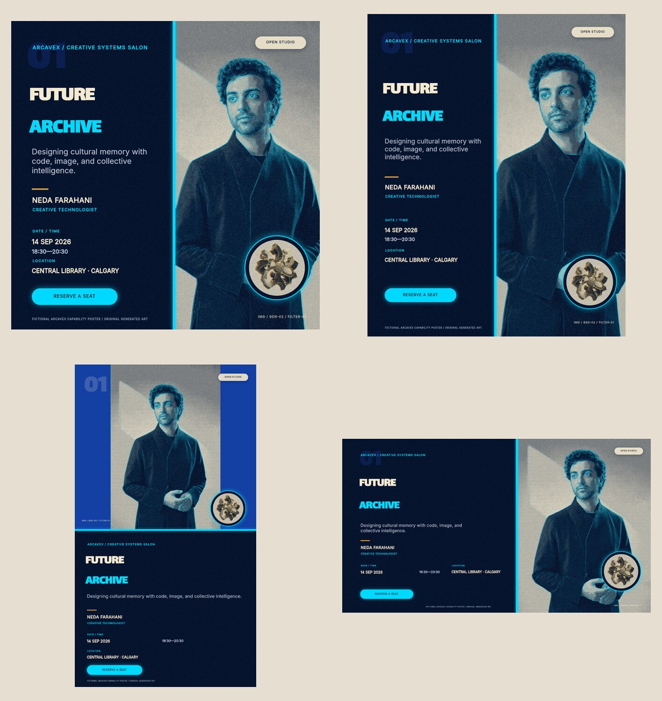
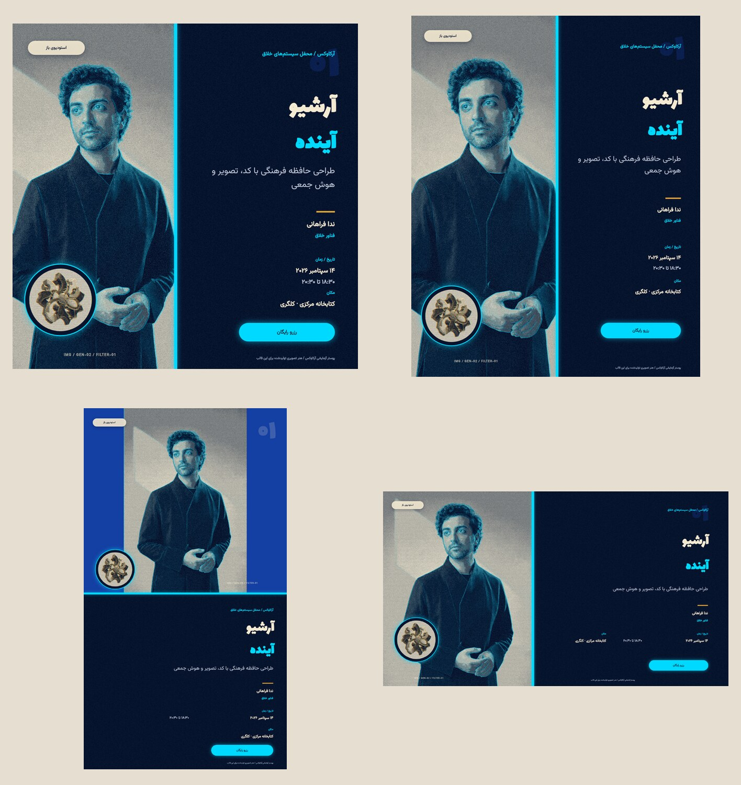

# Future Archive poster template

A production-oriented Arcavex example built to exercise generated raster assets, a local style
pack, a custom deterministic effect extension, masks, composite effects, multilingual shaping,
and deliberate square / portrait / story / landscape composition.

| English — LTR | Farsi — RTL |
|---|---|
|  |  |

The real MCP test covered normal and maximum-contract content across both locales and all four
formats: 16/16 cases passed validation, preview, layout inspection, and final rendering with no
warnings or diagnostics. A repeat render was byte-identical. See
[`output/mcp-report.json`](output/mcp-report.json) for the recorded results.

## Content contract

- `title_primary` and `title_secondary`: one display line each, up to 18 characters.
- `kicker`: one line, up to 42 characters.
- `subtitle`: up to 110 characters and three lines in compact formats.
- `badge`: up to 18 characters; `cta`: up to 24 characters.
- `date_value` and `venue_value`: up to 40 characters; `time_value`: up to 22 characters.
- `speaker_name`: up to 32 characters; `speaker_role`: up to 42 characters.
- `main_image` should be a portrait-safe 2:3 image with crop room around the subject.
- `accent_image` should have a centered, thumbnail-readable object.

Content outside that contract is expected to fail validation instead of silently clipping.

## Visual system

The `future-archive.yaml` style pack defines deep ink, cobalt, electric cyan, warm paper, and
aged-brass tokens; display/body/meta font roles; and reusable effect presets. The generated
portrait and data-relic images remain typography-free. Arcavex applies `archive-print` to build
the shared graphic language at render time.

## Custom filter

`extensions/archive-print` is an Arcavex raster-effect extension created through
`arcavex ext scaffold`. It provides a three-ink tonal map, ordered micro-screen, edge/cool-chroma
misregistration, scan bands, and seeded texture. Its golden test checks byte determinism and
bounds honesty.

## Example renders

Use the example's isolated Arcavex home after adding and enabling the extension:

```sh
arcavex render template.yaml --data data/en.yaml --format square --locale en -o output/en-square.png
arcavex render template.yaml --data data/fa.yaml --format square --locale fa -o output/fa-square.png
```
